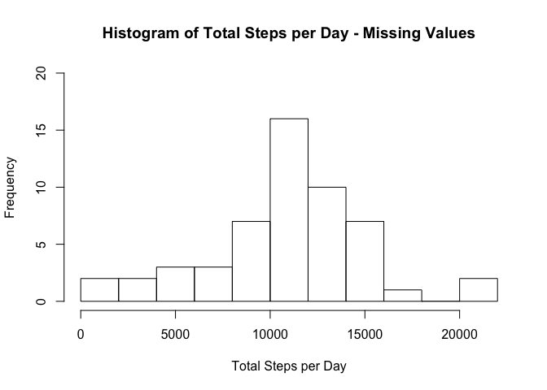
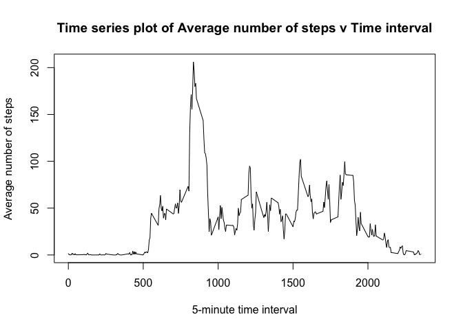
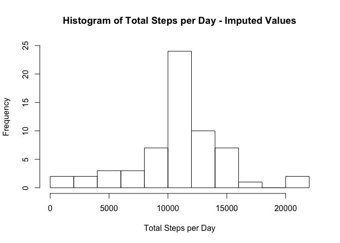
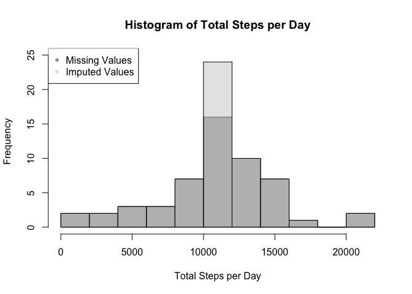
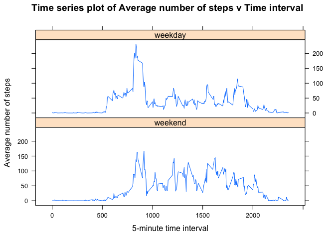

# Reproducible Research: Peer Assessment 1


## Loading and preprocessing the data

This code downloads a zip file of activity data from the internet, unzips it and
stores the unzipped file *(activity.csv)* in a newly created directory structure *(/data/activity/)*.
The data file is then read into R as a data frame called stepsData.
The 'date' variable of the data frame stepsData is converted to a date format readable in R.

```r
##  Download zip file from the internet and unzip
##  if(!file.exists("./data")) {dir.create("./data")}
##  fileUrl <- ("https://d396qusza40orc.cloudfront.net/repdata%2Fdata%2Factivity.zip")
##  download.file(fileUrl, destfile = "./data/activity.zip")
##  unzip(zipfile="./data/activity.zip",exdir="./data/activity")

##  Read in data files
stepsData <- read.csv("data/activity/activity.csv")
##  Reformat dates
stepsData$date <- as.Date(as.character(stepsData$date), "%Y-%m-%d")
```


## What is mean total number of steps taken per day?

The steps taken during each 5-minute time interval each day are aggregated and
summed to give the total steps taken per day.

```r
##  Calculate total steps per day
stepsAgg <- aggregate(stepsData$steps, list(Date = stepsData$date), sum)
names(stepsAgg)[names(stepsAgg)=="x"] <- "Total.steps"
```

Here is a histogram of the total steps per day.


```r
##  Construct histogram of total steps taken per day and amend labels and y limit
hist(stepsAgg$Total.steps, breaks = 13, main = "Histogram of Total Steps per Day - Missing Values",
     xlab = "Total Steps per Day", ylim = c(0, 20))
```

<!-- -->

The following code calculates the mean and median total number of steps taken each day.

```r
## Calculate mean and median of total steps taken per day
meanSteps <- mean(stepsAgg$Total.steps, na.rm=TRUE)
medianSteps <- median(stepsAgg$Total.steps, na.rm = TRUE)
```

The mean number of steps per day = 1.0766\times 10^{4}.
The median number of steps per day = 10765.


## What is the average daily activity pattern?

The following code calculates the average number of steps taken per 5-minute time interval.

```r
##  Calculate average steps taken per interval
intervalAgg <- aggregate(stepsData$steps, list(interval = stepsData$interval), mean, na.rm = TRUE)
names(intervalAgg)[names(intervalAgg)=="x"] <- "Avg.steps"
```

This is a time series plot of the average number of steps taken per 5-minute time interval
during an average day.

```r
##  Construct a time series plot of average number of steps taken per time interval 
plot(intervalAgg$interval, intervalAgg$Avg.steps, type = "l",
     main = "Time series plot of Average number of steps v Time interval",
     xlab = "5-minute time interval", ylab = "Average number of steps")
```

<!-- -->


```r
## Find the time interval with the most number of steps
maxStepInterval <- intervalAgg[intervalAgg$Avg.steps == max(intervalAgg$Avg.steps, na.rm = TRUE),]
```

The 5-minute time interval, on average across all the days in the dataset, with
the maximum number of steps is interval 835.


## Imputing missing values


```r
##  Calculate the number of rows containing missing values i.e. NA
missingVal <- sum(!complete.cases(stepsData))
```

The number of rows in the dataset with missing values is 2304.

The following code replaces missing values with the mean of the number of steps for that 5-minute time interval.


```r
##  Fill in all of the missing values in the dataset based on the mean of the
##  5 minute time interval and create a new dataset
library(plyr)
impute.mean <- function(x) replace(x, is.na(x), mean(x, na.rm = TRUE))
stepsData2 <- ddply(stepsData, ~ interval, transform, steps = impute.mean(steps))
stepsData2 <- stepsData2[order(stepsData2$date), ]
```

This is a histogram of the new dataset with missing values replaced using the mean number of steps for the 5-minute interval.


```r
##  Construct histogram of total steps taken per day for the new dataset and
##  amend labels and y limit
stepsAgg2 <- aggregate(stepsData2$steps, list(Date = stepsData2$date), sum)
names(stepsAgg2)[names(stepsAgg2)=="x"] <- "Total.steps"

hist(stepsAgg2$Total.steps, breaks = 13, main = "Histogram of Total Steps per Day - Imputed Values",
     xlab = "Total Steps per Day", ylim = c(0, 25))
```

<!-- -->

Comparing the mean and median of the total number of steps taken per day before and after the missing values are replaced gives an indication of how the addition of the new values impacts the dataset.

```r
##  Calculate mean and median of total steps taken per day
meanSteps2 <- mean(stepsAgg2$Total.steps, na.rm=TRUE)
medianSteps2 <- median(stepsAgg2$Total.steps, na.rm = TRUE)
```

The mean number of steps per day with missing values replaced is 1.0766\times 10^{4} which corresponds to the mean of 1.0766\times 10^{4} before replacement. 
The median number of steps per day with missing values replaced is 1.0766\times 10^{4}, matching the means above but different from median before replacing missing values which was 10765.

The following plot indicates that the addition of missing values has increased the frequency of total daily number of steps in the 10,000 to 12,000 range.


```r
hist(stepsAgg$Total.steps, breaks = 13, col=rgb(0.3,0.3,0.3,1/2), ylim = c(0, 25), main = "Histogram of Total Steps per Day", xlab = "Total Steps per Day")
hist(stepsAgg2$Total.steps, breaks = 13, col=rgb(0.8,0.8,0.8,1/2), add=T)
legend("topleft", legend = c("Missing Values", "Imputed Values"), pch = 20, col = c(rgb(0.3,0.3,0.3,1/2),rgb(0.8,0.8,0.8,1/2)))
```

<!-- -->


## Are there differences in activity patterns between weekdays and weekends?

The following code creates a new factor variable to distinguish weekdays from weekends.

```r
##  Create a new factor variable with levels "weekday" and "weekend"
weekDayF <- c('Monday', 'Tuesday', 'Wednesday', 'Thursday', 'Friday')
stepsData2$wkDay <- factor((weekdays(stepsData2$date) %in% weekDayF),
    levels=c(FALSE, TRUE), labels=c('weekend', 'weekday'))
```

The following is a time series panel plot of the average number of steps taken per 5-minute time interval
during an average weekday compared to an average weekend day.


```r
##  Make a panel plot containing a time series plot (i.e. 𝚝𝚢𝚙𝚎 = "𝚕") 
##  of the 5-minute interval (x-axis) and the average number of steps taken,
##  averaged across all weekday days or weekend days

##  Calculate average steps taken per interval using new dataset
intervalAgg2 <- aggregate(stepsData2$steps, list(interval = stepsData2$interval, wkDay = stepsData2$wkDay), mean, na.rm = TRUE)
names(intervalAgg2)[names(intervalAgg2)=="x"] <- "Avg.steps"

library(lattice)
p <- xyplot(intervalAgg2$Avg.steps ~ intervalAgg2$interval | intervalAgg2$wkDay,
            data = stepsData2, type = "l", layout = c(1, 2),
            main = "Time series plot of Average number of steps v Time interval",
            xlab = "5-minute time interval", ylab = "Average number of steps" )
print(p)
```

<!-- -->

It is clear from the plot that during the week activity starts to peaks between 5.00 am and 8.30 am with smaller peaks around lunch time, mid afternoon and around 7.00 pm in the evening. At weekends the morning peak starts later at approximately 7.30 - 8.00 am but reaches a slightly lower maximum at a similar time to weekdays between 8.30 and 9.00 am with further peaks during the day at similar times to weekdays but at higher average levels of activity, tailing off slightly later in the evening.  
